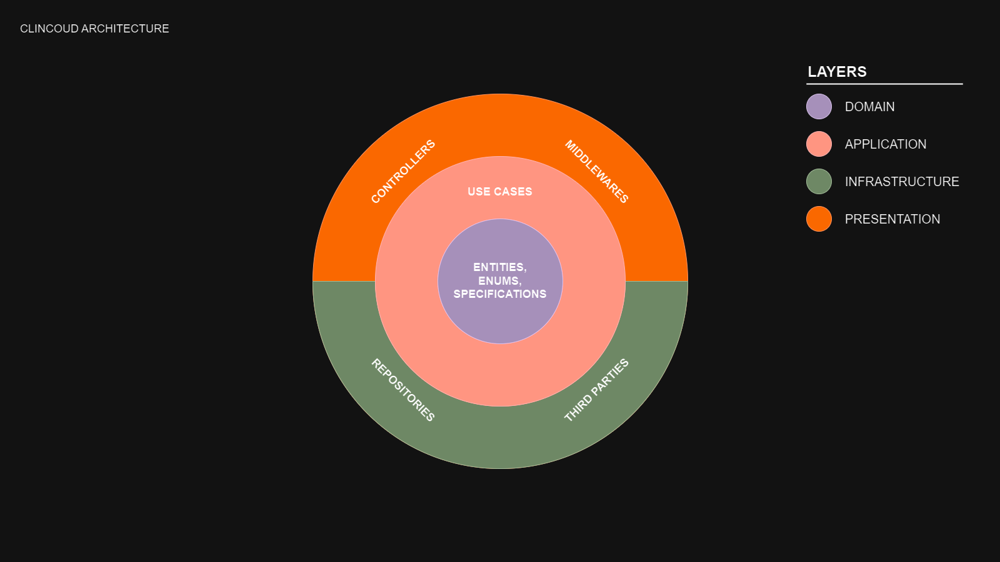

<a href="https://www.npmjs.com/package/clincoud" target="_blank"></a>
<a href="https://www.npmjs.com/package/clincoud" target="_blank"></a>

# Clincoud

<p align="center">
  
</p>
<p align="center" style="margin-top: 10px;">The Node.js framework that encourages you to create a clean, layered architecture.</p>

## Table of Contents

- [Introduction](#introduction)
  - [Philosophy](#philosophy)
  - [Architecture](#architecture)
    - [Layers](#layers)
      - [Domain](#domain)
      - [Application](#application)
      - [Infrastructure](#infrastructure)
      - [Presentation](#presentation)
- [Overview](#overview)
  - [Getting Started](#getting-started)
  - [App](#app)
  - [Modules](#modules)
  - [Controllers](#controllers)
  - [Middlewares](#middlewares)
- [Support the Project](#support-the-project)
- [License](#license)

## Introduction

// TODO

### Philosophy

// TODO

### Architecture

The main reason that hinders the correct implementation of a clean architecture is that, as it is a set of theoretical principles, each developer implements it in a different way:

- The number of layers may vary.
- The name of each layer can also be different.
- Depending on the programming language used, the implementations of each of the layers can be influenced by the conventions and good practices of the language.

For these reasons it is important to clarify that this is simply ANOTHER IMPLEMENTATION of a clean architecture, but that is why we accompany it with documentation that explains its peculiarities.

And of course this architecture is open to be modified in later versions if at some point we understand that there is a better way of doing things.

<p align="center">
  
</p>

#### Layers

// TODO

##### Domain

// TODO

##### Application

// TODO

##### Infrastructure

// TODO

##### Presentation

// TODO

## Overview

This section is a tour to understand the main concepts of the framework.

### Getting Started

// TODO

### App

The Clincoud application is where controllers are registered and lifecycle events are managed.

Write your `App` extending `BaseApp` and add all the logic you need. A good example of use is to establish the connection to the database in the callback of the `initialized` event.

```typescript
import { BaseApp, MongooseConnectionToken } from "clincoud";
import { imported, injectable, provided } from "inversify-sugar";
import { Connection } from "mongoose";

@injectable()
export default class App extends BaseApp {
  constructor(
    @provided(MongooseConnectionToken)
    private readonly mongooseConnectionProvider: () => Promise<Connection>
  ) {
    super();
  }

  public async onInitialized() {
    await this.mongooseConnectionProvider();
  }
}
```

Then you have to bind the `App` class as a provider to the `AppModule` using the `AppToken` service identifier.

```typescript
import {
  AppConfigToken,
  PortToken,
  CoreModule,
  AppToken,
  MongooseModule,
} from "clincoud";
import { module } from "inversify-sugar";
import App from "./App";

@module({
  imports: [
    CoreModule,
    MongooseModule.forRoot({ uri: process.env.DATABASE_URI }),
  ],
  providers: [
    {
      provide: PortToken,
      useValue: process.env.PORT,
    },
    { useClass: App, provide: AppToken },
    {
      provide: AppConfigToken,
      useValue: appConfig,
    },
  ],
})
export class AppModule {}
```

### Modules

Clincoud delegates the hierarchical dependency system to the `inversify-sugar` package, which offers a rather elegant agnostic API.

See the [inversify-sugar documentation](https://github.com/carlossalasamper/inversify-sugar) documentation to learn more about this [Inversify](https://inversify.io/) framework.

### Controllers

// TODO

### Middlewares

// TODO

## Support the Project

<p align="center">☕️ Buy me a coffee so the open source party never ends.</p>

<p align="center"><a href="https://www.buymeacoffee.com/carlossala95" target="_blank"></a></p>

<p align="center">
  <a href="https://www.youtube.com/channel/UCC-EUKPStBfQ1nEIvSl6bAQ" target="_blank">YouTube</a> |
  <a href="https://instagram.com/carlossalasamper" target="_blank">Instagram</a> |
  <a href="https://twitter.com/carlossala95" target="_blank">Twitter</a> |
  <a href="https://facebook.com/carlossala95" target="_blank">Facebook</a>
</p>
<p align="center">
  <a href="https://godofprogramming.com" target="_blank">godofprogramming.com</a>
</p>

## License

The Clincoud source code is made available under the [MIT license](./LICENSE).

Some of the dependencies are licensed differently, with the BSD license, for example.
